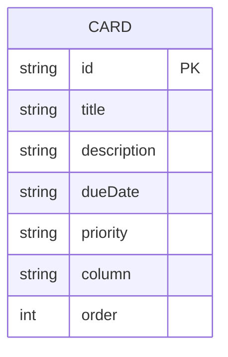

# ER図

[← 要件定義書に戻る](requirements.md)

テーブルの詳細な項目定義は [データベース設計](database-design.md) を参照。

- 本アプリで管理するエンティティは `CARD`(カード)のみであり、他エンティティとの関連は持たない
- カラム(未着手・着手・完了)はマスタテーブルを持たず、`column` フィールドの値("todo" / "doing" / "done")として表現する
