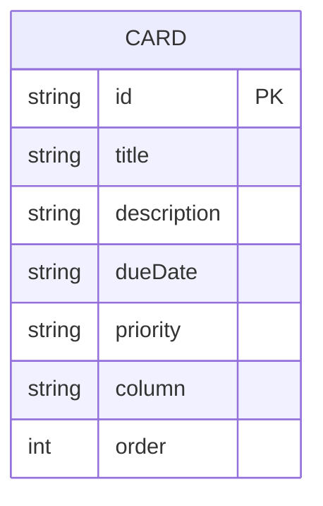

# タスク管理アプリ 要件定義書

## 1. 概要
Trello風の見た目を持つ、シンプルなタスク管理Webアプリを作成する。
本ドキュメントはスクール課題として、要件定義の practice を兼ねて作成する。

## 2. 目的
- 自分自身のタスクを「未着手」「着手」「完了」の3段階で視覚的に管理する
- カードのドラッグ&ドロップによる直感的な操作を体験・実装する
- フロントエンドとバックエンド(API・DB)を分離した、一般的なWebアプリケーション構成を学習・実装する

## 3. 想定利用者
- 開発者本人(自分専用ツールとして利用)
- ログイン機能・複数ユーザー対応は行わない

## 4. スコープ

### 4.1 対象範囲(In Scope)
- カラム(未着手・着手・完了)によるタスク管理
- カードの作成・編集・削除
- カードのカラム間移動(ドラッグ&ドロップ)
- 同一カラム内でのカードの並び替え(ドラッグ&ドロップ)
- バックエンドAPI経由でのデータ永続化(ブラウザを閉じてもデータが消えない)

### 4.2 対象外(Out of Scope)
- 複数ボードの管理
- ログイン・ユーザー管理・複数人での共有
- カードへの添付ファイル・コメント機能
- カラムの追加・削除・名称変更
- モバイルアプリ化・オフライン同期

## 5. 機能要件

| No. | 機能名 | 内容 |
|---|---|---|
| F-01 | カラム表示 | 「未着手」「着手」「完了」の3カラムを画面に表示する |
| F-02 | カード追加 | 各カラムに、タイトル・説明文・期限・優先度を入力してカードを新規作成できる |
| F-03 | カード編集 | 既存カードのタイトル・説明文・期限・優先度を変更できる |
| F-04 | カード削除 | 不要になったカードを削除できる |
| F-05 | カラム間移動 | カードをドラッグ&ドロップで別のカラムへ移動できる |
| F-06 | カラム内並び替え | 同一カラム内でカードをドラッグ&ドロップし、表示順序を変更できる |
| F-07 | データ永続化 | カードの追加・編集・削除・移動・並び替えの結果を保存し、ページ再読み込みやブラウザ再起動後も復元する |

### 5.1 カードの入力項目

| 項目名 | 型 | 必須 | 備考 |
|---|---|---|---|
| タイトル | 文字列 | 必須 | 最大100文字程度を想定 |
| 説明文 | 文字列 | 任意 | 複数行入力可 |
| 期限 | 日付 | 任意 | 年月日を選択 |
| 優先度 | 選択式 | 必須 | 「高」「中」「低」の3段階、初期値は「中」 |

## 6. ユースケース

### UC-01 カードを新規作成する
- アクター: 開発者本人
- 事前条件: アプリが起動しており、いずれかのカラムが表示されている
- 基本フロー:
  1. 対象カラムの「+ カードを追加」をクリックする
  2. タイトル・説明文・期限・優先度を入力する(タイトルのみ必須)
  3. 保存操作を行う
  4. カードが対象カラムの末尾に表示される
- 事後条件: 新しいカードがバックエンドに保存され、再読み込み後も表示される

### UC-02 カードを編集する
- アクター: 開発者本人
- 事前条件: 編集したいカードが画面上に表示されている
- 基本フロー:
  1. 対象カードをクリックする
  2. 編集用モーダルが開き、現在の入力内容が表示される
  3. タイトル・説明文・期限・優先度のいずれかを変更する
  4. 保存操作を行う
  5. モーダルが閉じ、カードの表示内容が更新される
- 事後条件: 変更内容がバックエンドに保存され、再読み込み後も反映されている

### UC-03 カードを削除する
- アクター: 開発者本人
- 事前条件: 削除したいカードが画面上に表示されている
- 基本フロー:
  1. 対象カードをクリックし、編集用モーダルを開く
  2. 削除操作を行う
  3. 確認の上、カードが画面上から消える
- 事後条件: カードがバックエンドから削除され、再読み込み後も表示されない

### UC-04 カードを別カラムへ移動する
- アクター: 開発者本人
- 事前条件: 移動元カラムに対象カードが存在する
- 基本フロー:
  1. 対象カードをドラッグする
  2. 移動先カラムの任意の位置にドロップする
  3. カードが移動先カラムに表示され、移動元カラムから消える
- 事後条件: カードの所属カラムと表示順序がバックエンドに保存され、再読み込み後も維持される

### UC-05 同一カラム内でカードの順序を入れ替える
- アクター: 開発者本人
- 事前条件: 対象カラムに2枚以上のカードが存在する
- 基本フロー:
  1. 並び替えたいカードをドラッグする
  2. 同一カラム内の別の位置にドロップする
  3. カードの表示順序が入れ替わる
- 事後条件: 新しい並び順がバックエンドに保存され、再読み込み後も維持される

### UC-06 アプリ起動時に保存済みのタスクを表示する
- アクター: 開発者本人
- 事前条件: 過去にカードを作成・編集した実績があり、バックエンドにデータが保存されている
- 基本フロー:
  1. ブラウザでアプリの画面を開く
  2. フロントエンドがバックエンドAPIへ全カード取得のリクエストを送る
  3. 取得したカードが、所属カラム・順序どおりに画面へ表示される
- 事後条件: 前回終了時点の状態がそのまま復元されている

## 7. 非機能要件

| No. | 項目 | 内容 |
|---|---|---|
| N-01 | 動作環境 | 最新版の主要ブラウザ(Chrome / Edge など)で動作すること |
| N-02 | 保存方式 | バックエンドサーバーを介し、DB(SQLiteを想定)にデータを保存する |
| N-03 | 実行環境 | フロントエンド・バックエンドの両方を起動した状態で動作すること(バックエンドの具体的な技術スタックは別途決定) |
| N-04 | 文字コード | UTF-8 |
| N-05 | 通信方式 | フロントエンドはバックエンドが提供するREST APIを介してデータを取得・更新する |

## 8. 画面設計(概要)

```
┌───────────────────────────────────────────────┐
│                  タスク管理                     │
├───────────────┬───────────────┬───────────────┤
│    未着手      │     着手       │     完了       │
├───────────────┼───────────────┼───────────────┤
│ [カード]       │ [カード]       │ [カード]       │
│ [カード]       │               │               │
│               │               │               │
│ [+ カードを追加]│ [+ カードを追加]│ [+ カードを追加]│
└───────────────┴───────────────┴───────────────┘
```

- カードには「タイトル」「優先度(色分け表示)」「期限」を表示する
- カードをクリックすると、編集用の画面(モーダル)が開く
- カードはドラッグして別カラムへ移動、または同一カラム内で順序変更できる

## 9. データ設計

### 9.1 システム構成
```
[ブラウザ(フロントエンド)] ── REST API ──> [バックエンドサーバー] ──> [DB (SQLite想定)]
```
- フロントエンドはUI表示とドラッグ&ドロップ操作を担当し、データの永続化はAPI経由でバックエンドに委譲する
- バックエンドの具体的な言語・フレームワークは別途決定する

### 9.2 ER図



- 本アプリで管理するエンティティは `CARD`(カード)のみであり、他エンティティとの関連は持たない
- カラム(未着手・着手・完了)はマスタテーブルを持たず、`column` フィールドの値("todo" / "doing" / "done")として表現する

### 9.3 カードのデータ構造
1枚のカードを以下の構造で管理する。DB上では `cards` テーブル(仮)として保持する。

| フィールド名 | 型 | 説明 |
|---|---|---|
| id | 文字列 | カードを一意に識別するID |
| title | 文字列 | タイトル |
| description | 文字列 | 説明文 |
| dueDate | 文字列(日付) | 期限 |
| priority | 文字列 | "high" / "medium" / "low" のいずれか |
| column | 文字列 | "todo" / "doing" / "done" のいずれか(所属カラム) |
| order | 数値 | 同一カラム内での表示順序 |

### 9.4 API設計(概要)

| メソッド | エンドポイント | 内容 |
|---|---|---|
| GET | /api/cards | 全カードを取得する |
| POST | /api/cards | カードを新規作成する |
| PUT | /api/cards/:id | カードを更新する(内容変更・カラム移動・並び替え) |
| DELETE | /api/cards/:id | カードを削除する |

具体的なリクエスト/レスポンス仕様は、バックエンドの技術選定後に詳細設計として別途定める。

## 10. 用語定義

| 用語 | 意味 |
|---|---|
| カード | 1つのタスクを表す単位 |
| カラム | タスクの進行状況を表す列(未着手・着手・完了) |
| バックエンド | データの保存・取得などを担うサーバー側のプログラム |
| API | フロントエンドとバックエンドがデータをやり取りするための窓口 |
| DB(データベース) | カードのデータを永続的に保存する仕組み。本アプリではSQLiteを想定 |

## 11. 今後の拡張候補(参考)
- カラムの自由な追加・編集
- 複数ボードへの対応
- タグ・ラベル機能
- 検索・フィルタ機能
